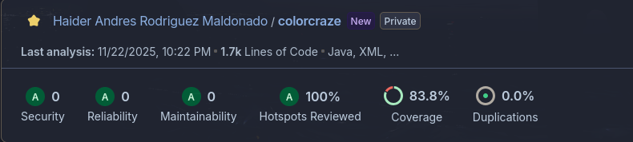
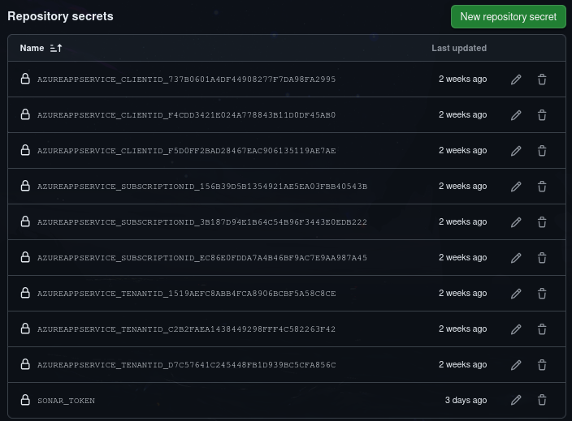
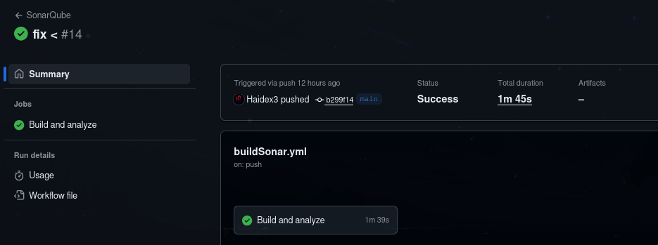
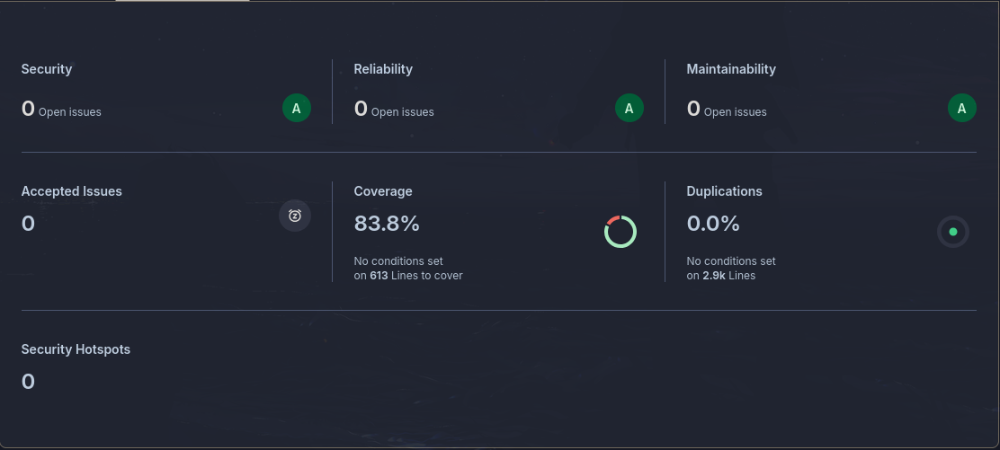
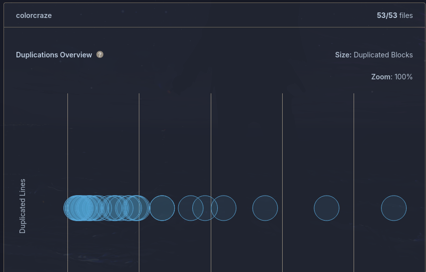

# **Integración de SonarCloud en el Backend**

## 1. Introducción

Para garantizar la calidad del código del backend del proyecto *Color Craze*, se integró **SonarCloud** con el flujo de CI (GitHub Actions). Esta integración permite:

* Analizar automáticamente el código en cada *push* o *pull request*.
* Aplicar el **Quality Gate** de SonarCloud.
* Visualizar métricas como bugs, code smells, duplicaciones, cobertura, deuda técnica, etc.
* Mantener historial de calidad a través del tiempo.

Este documento describe cómo se configuró la integración, cómo funciona actualmente y qué se espera en etapas futuras.

---

# 2. Configuración realizada

## 2.1. Creación y configuración del proyecto en SonarCloud

Se realizaron los siguientes pasos:

1. Se creó la organización en SonarCloud (con cuenta GitHub).
2. Se vinculó el repositorio del backend.
3. Se generó el **token SONAR_TOKEN** desde *My Account → Security*.
4. Se creó el archivo de propiedades del proyecto:

```
sonar.organization=<organización>
sonar.projectKey=<projectKey>
sonar.projectName=<projectName>
sonar.host.url=https://sonarcloud.io
sonar.sources=src/main/java
sonar.tests=src/test/java
sonar.java.binaries=target/classes
```



---

## 2.2. Configuración del pipeline GitHub Actions

Se agregó un workflow independiente para ejecutar el análisis:

### **Archivo `.github/workflows/sonarcloud.yml`**

```yaml
name: SonarQube

on:
  push:
    branches:
      - main
jobs:
  build:
    name: Build and analyze
    runs-on: ubuntu-latest

    steps:
      - uses: actions/checkout@v4
        with:
          fetch-depth: 0 

      - name: Set up JDK 21
        uses: actions/setup-java@v4
        with:
          java-version: 21
          distribution: 'zulu'

      - name: Cache SonarQube packages
        uses: actions/cache@v4
        with:
          path: ~/.sonar/cache
          key: ${{ runner.os }}-sonar
          restore-keys: ${{ runner.os }}-sonar

      - name: Cache Maven packages
        uses: actions/cache@v4
        with:
          path: ~/.m2
          key: ${{ runner.os }}-m2-${{ hashFiles('**/pom.xml') }}
          restore-keys: ${{ runner.os }}-m2

      - name: Build and analyze
        env:
          SONAR_TOKEN: ${{ secrets.SONAR_TOKEN }}
        run: mvn -B verify org.sonarsource.scanner.maven:sonar-maven-plugin:sonar -Dsonar.projectKey=Haidex3_Color-craze-Backend-parte1
```




---

## 2.3. Resultado de la integración

Cada vez que se hace un push:

1. GitHub ejecuta Maven (`mvn verify`)
2. Se lanza el análisis de SonarCloud
3. Sonar actualiza métricas del proyecto
4. Si el Quality Gate falla, el PR mostrará un estado rojo (si se activa)




---

---

# 3. Cómo se utiliza el análisis en el día a día

* Cada integrante del equipo puede revisar el reporte tras cada push.
* Los PR muestran inmediatamente si pasan el Quality Gate.
* El equipo detecta rápido:

  * código duplicado
  * errores de seguridad
  * complejidad excesiva
  * malas prácticas
* Se pueden asignar issues de SonarCloud directamente a miembros del equipo (pero como estoy solo me toca a mi jajjsajs)

---

# 4. Conclusión

La integración de SonarCloud en el backend ya cumple los criterios de la historia H-Mantenibilidad-01:

| Tarea                             | Estado                      | Detalle                               |
| --------------------------------- | --------------------------- | ------------------------------------- |
| Configurar proyecto en SonarCloud | **✔ Hecho**                 | Se creó proyecto con claves.          |
| Pipeline para ejecutar análisis   | **✔ Hecho**                 | Pipeline funcional con Maven + Sonar. |
| Documentación                     | **✔ Este documento**        | Hecho         |

Esta base permite extender la calidad del proyecto y garantizar mantenibilidad para el futuro.

---
